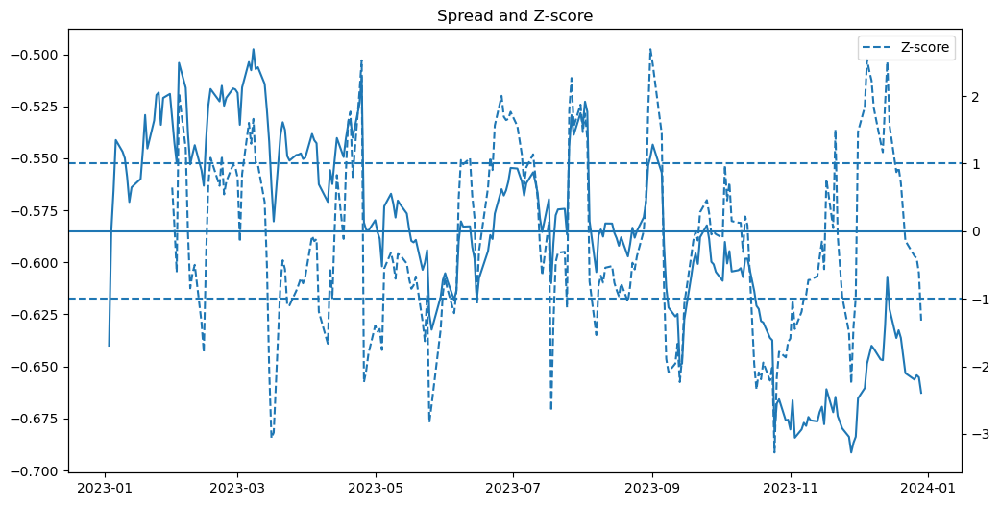
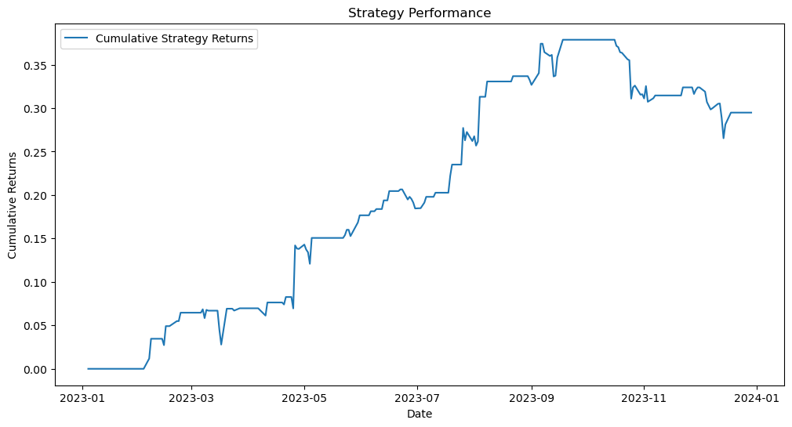

# Pair Trading Strategy – AAPL / MSFT

## Context

This project explores a basic pair trading strategy based on mean reversion between two stocks.

## Objective

The goal is to implement a simple statistical arbitrage strategy and evaluate its performance using historical market data.

## Methodology

- Download historical prices using yfinance
- Compute the spread using **log-prices**
- Normalize the spread using a **Rolling z-score** (to avoid look-ahead bias)
- Define entry and exit rules based on threshold values
- Backtest the strategy over the year 2023

## Performance

- **Sharpe Ratio:** 1.87
- **Cumulative Return:** 29.49%
- **Volatility:** 15.96%
- **Max Drawdown:** -11.34%

The strategy exhibits strong risk-adjusted performance over the selected period.

## Results

The spread shows mean-reverting behavior, generating trading opportunities when extreme deviations occur.

## Limitations

- No transaction costs or slippage
- No statistical validation (e.g. cointegration)
- Simplified spread model (no hedge ratio)
- Strategy tested on a single time period (no out-of-sample validation)

## Possible Improvements

- Estimate hedge ratio using regression
- Performe cointegration test
- Add transaction costs and slippage
- Implement risk management
- Perform out-of-sample and walk-forward testing