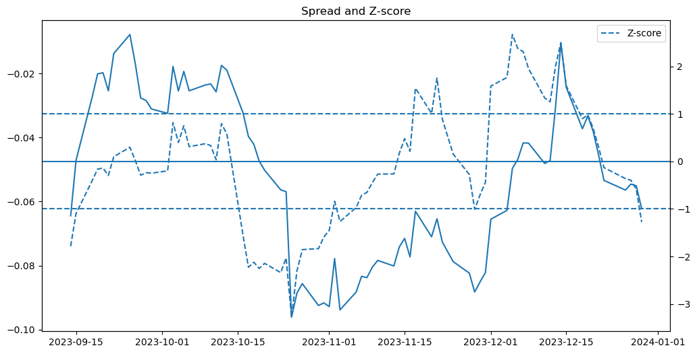
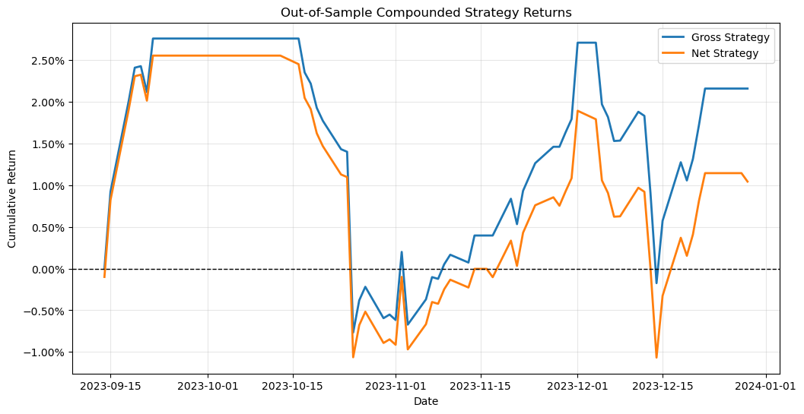
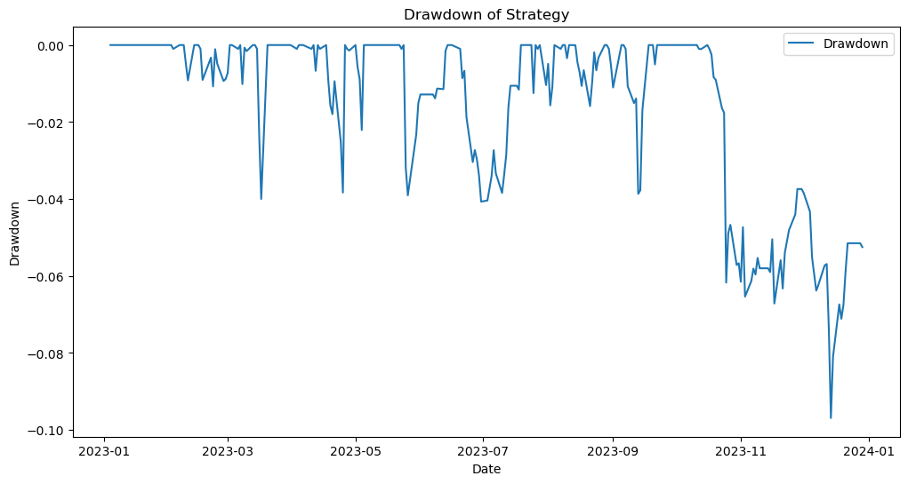

# Pair Trading Strategy – AAPL / MSFT

## Context

This project explores a pair trading strategy based on mean reversion between two stocks.

Pair trading aims to identify a long-term statistical relationship between two assets and trade temporary deviations from that relationship. The strategy takes opposite positions in the two assets rather than relying on the direction of the overall market.

## Objective

The objective is to implement and evaluate a simple statistical arbitrage strategy while addressing common backtesting issues such as:

- Look-ahead bias
- Persistent position management
- Hedge-ratio consistency
- Portfolio exposure normalization
- Transaction costs
- Compounded performance measurement

The project is intended as an educational implementation rather than a production-ready trading system.

## Data

Daily closing prices are downloaded with yfinance for:

- AAPL
- MSFT

The complete dataset covers the 2023 calendar year.

The observations are divided chronologically into:

- **Training period:** first 70% of the observations
- **Out-of-sample backtest period:** remaining 30%

In the current dataset, this corresponds approximately to:

- **Training:** January 3, 2023 to September 13, 2023
- **Backtest:** September 14, 2023 to December 29, 2023

The chronological split ensures that the model is estimated using only information available before the backtest period.

## Methodology

### Cointegration test

An Engle-Granger cointegration test is performed on the log-prices from the training period only.

The current training sample produces a p-value of approximately: **0.0056**

This provides in-sample evidence of a long-term statistical relationship between AAPL and MSFT during the training period. It does not guarantee that this relationship will remain stable in other periods.

### Hedge-ratio estimation

An OLS regression is fitted on the training log-prices: **log(AAPL)** = alpha + beta × log(MSFT) + error
The current estimates are approximately:

- **alpha** = 0.3026
- **beta** = 0.8475

The intercept and hedge ratio are estimated exclusively on the training period and remain fixed throughout the out-of-sample backtest.

### Spread construction

The statistical spread is defined as: **spread** = log(AAPL) - alpha - beta × log(MSFT)

The coefficients estimated on the training period are applied without re-estimation during the backtest.

#### Rolling z-score

The spread is normalized using a 20-day rolling z-score: 
- **z-score** = (spread - rolling mean) / rolling standard deviation

Each value uses only current and past observations, preventing future information from entering the signal.

### Trading signals

The strategy uses the following rules:

- Open a **short-spread** position when the z-score exceeds +1
- Open a **long-spread** position when the z-score falls below -1
- Maintain the position until the z-score returns to zero
- Start the out-of-sample backtest with no open position

A long-spread position represents long AAPL and short MSFT according to the estimated hedge ratio. A short-spread position reverses these exposures.

### Strategy returns

The daily hedged-pair return is approximated by: **AAPL return - beta × MSFT return**

It is normalized by the total gross exposure: **1 + |beta|**

The previous day's position is applied to the current day's return: 

- **strategy return** = previous position × normalized pair return

This prevents a signal calculated from the current closing prices from being applied to the return that produced that signal.

### Transaction costs

A fixed transaction cost of 0.1% is applied to portfolio turnover.
The turnover model distinguishes between:

- Entry: turnover of 1
- Exit: turnover of 1
- Direct reversal, if permitted by the signal logic: turnover of 2
- Position maintenance: turnover of 0

Net returns are calculated by subtracting transaction costs from gross strategy returns.

### Performance measurement

Performance is evaluated using compounded portfolio returns.
The gross and net wealth curves both start from an initial value of 1.

Maximum drawdown is measured as the largest percentage decline of net portfolio wealth from a previous peak.

## Out-of-Sample Results

The current backtest produces approximately the following results:

### Gross Performance (before costs)

- **Cumulative Return:** 2.16%
- **Annualized Return:** 7.55%
- **Annualized Volatility:** 7.27%
- **Sharpe Ratio:** 1.04
- **Maximum Drawdown** -3.43%  

### Net Performance (after transaction costs)

- **Cumulative Return:** 1.04%
- **Annualized Return:** 3.55%
- **Annualized Volatility:** 7.14%
- **Sharpe Ratio:** 0.52
- **Maximum Drawdown** -3.53%  

Transaction costs reduce the strategy's cumulative return substantially over the relatively short backtest period.

Although the net result remains positive, the difference between gross and net performance demonstrates that trading frictions have a material effect on the strategy. These results are encouraging for an educational prototype but are not sufficient to establish robustness.

## Visualizations

The comparison between gross and net returns highlights the importance of accounting for transaction costs when evaluating trading strategies.

## Limitations

- Only one asset pair is evaluated  
- The out-of-sample period is relatively short  
- Cointegration may not remain stable over time
- The hedge ratio remains fixed throughout the backtest
- Transaction costs are simplified and constant
- Bid-ask spread variation and slippage are not modeled
- Short-selling fees and borrowing constraints are not included
- Position sizing and portfolio capital constraints are simplified
- No stop-loss or other risk-management mechanism is implemented
- The pair was not evaluated through multiple market regimes

The cointegration p-value describes the training sample only and should not be interpreted as proof that the relationship will persist.

## Possible Improvements

- Test multiple asset pairs  
- Evaluate the strategy over longer periods  
- Add walk-forward validation  
- Re-estimate the hedge ratio using rolling or expanding windows  
- Test the stability of cointegration over time
- Model bid-ask spreads, slippage, and short-selling costs
- Add position sizing and exposure limits
- Introduce risk-management rules
- Compare multiple entry and exit thresholds
- Perform parameter-sensitivity analysis
- Benchmark the strategy against a naive 1:1 pair portfolio